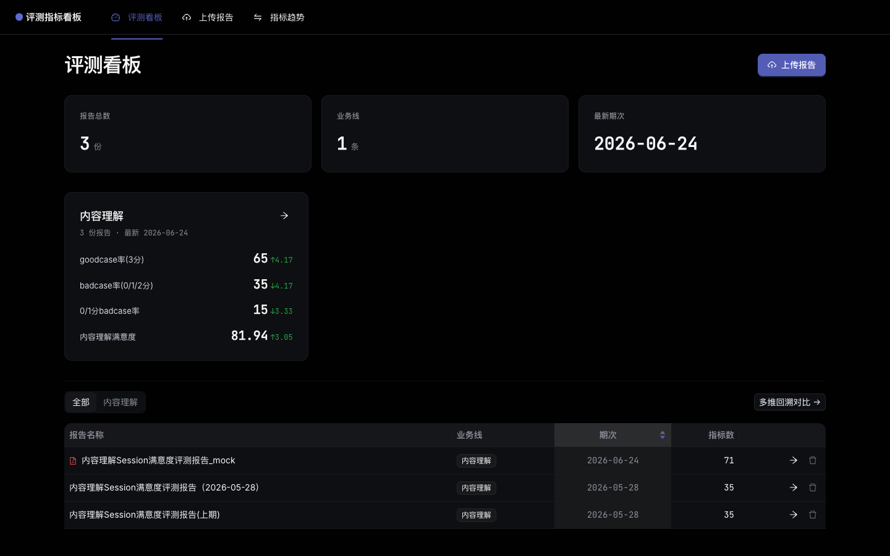
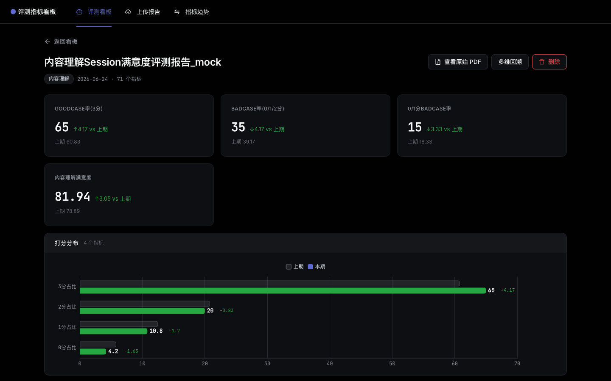
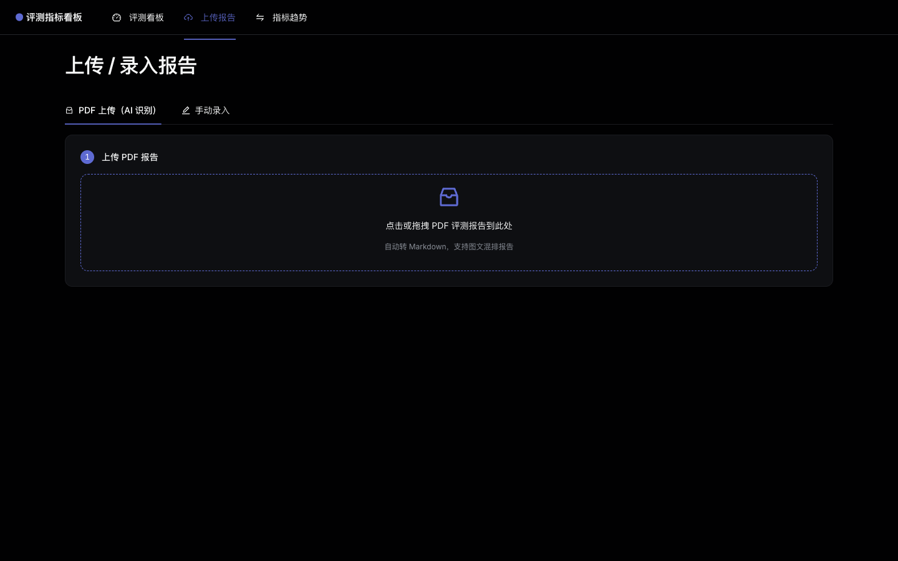
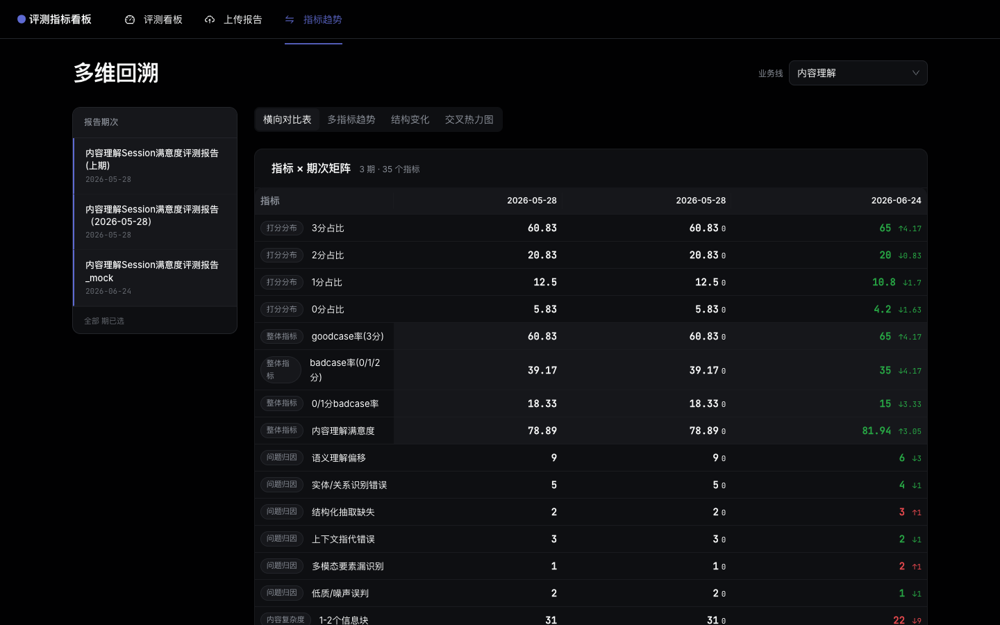
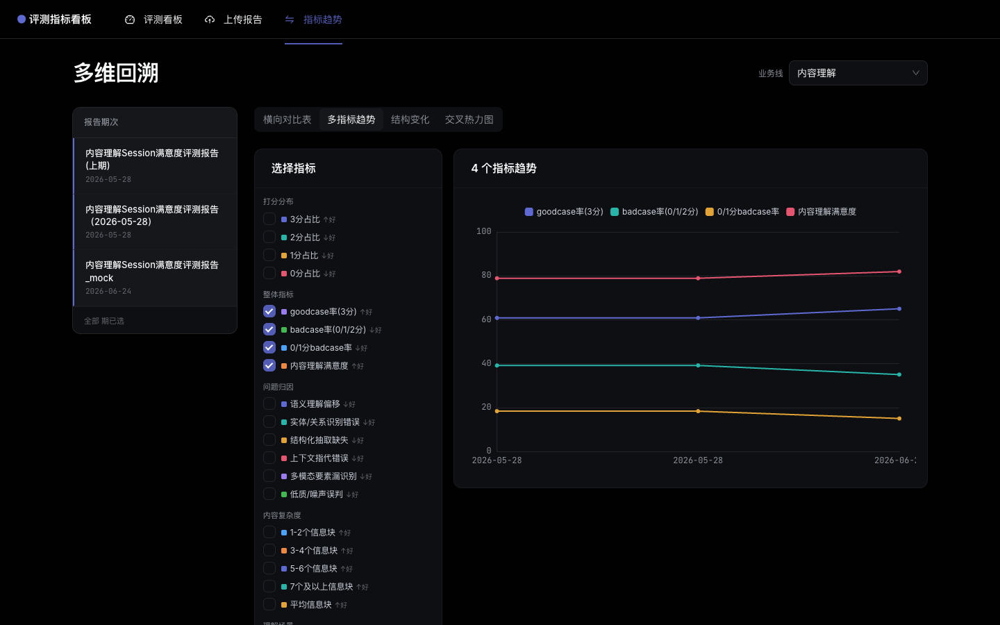

# 评测报告可视化与回溯平台

本地部署的轻量 Web 工具：上传 PDF / 手动录入评测报告 → 自动可视化 → 按时间跨期回溯对比。
界面采用 Linear 暗色设计风格。

---

## 功能截图

### 评测看板
总览所有业务线的最新指标、报告列表与趋势摘要。



---

### 报告详情
自动将指标拆分为「整体指标大数字卡片 + 分组横条图」，附带与上期的差值对比（绿色↑改善 / 红色↓劣化）。



---

### 上传报告 — PDF 智能识别
拖入 PDF 即自动解析为 Markdown，结合业务线脚本自动提取指标，人工核对后一键入库。



---

### 多维回溯 — 横向对比表
选定业务线后，所有历史期次的全量指标排成矩阵，每列自动计算与上期的差值并标色。



---

### 多维回溯 — 多指标趋势
勾选任意指标，拉出跨期折线图，直观看出哪个指标在向好、哪个在恶化。



---

## 核心功能

| 功能 | 说明 |
|---|---|
| PDF 上传 + AI 识别 | 拖入 PDF → 自动转 Markdown → 按业务线脚本提取指标 |
| 手动录入 | 补录历史数据或无 PDF 的评测结论 |
| 报告详情 | 大数字卡片 + 分组横条图 + 上期差值标色 |
| 横向对比表 | 指标 × 期次矩阵，自动算相邻期差值 |
| 多指标趋势 | 自定义勾选指标看跨期折线图 |
| 结构变化视图 | 选定分组，查看该组内各指标的跨期演变 |
| 交叉热力图 | 行 × 列维度的指标分布热力图，支持按期次切换 |
| 业务线筛选 | 看板和回溯页均可按业务线过滤 |
| 删除报告 | 支持从列表或详情页删除，二次确认防误删 |

---

## 快速开始

```bash
# 一键启动（自动建 venv、构建前端、起服务）
./start.sh
```

启动后浏览器自动打开 **http://localhost:8000**。

### 手动启动（开发模式）

```bash
# 后端
cd backend
python3 -m venv .venv && source .venv/bin/activate
pip install -r requirements.txt
uvicorn app.main:app --reload --port 8000

# 前端（另开一个终端）
cd frontend
npm install
npm run dev   # http://localhost:3000
```

---

## 项目结构

```
eval-platform/
├── backend/                FastAPI + SQLite + pandas
│   ├── app/
│   │   ├── parsers/        各业务线 PDF 解析脚本
│   │   └── routers/        API 路由（报告 / 模板 / 对比）
│   ├── scripts/            示例数据生成脚本
│   └── requirements.txt
├── frontend/               React + TypeScript + Vite + Ant Design 5 + ECharts
│   └── src/
│       ├── pages/          看板 / 上传 / 详情 / 多维回溯
│       └── components/     StatCard / GroupBarChart / TrendLineChart / CrossHeatmap
├── docs/screenshots/       README 截图
└── start.sh                一键启动
```

---

## 技术栈

| 层 | 技术 |
|---|---|
| 前端 | React 18 · TypeScript · Vite · Ant Design 5（暗色）· ECharts |
| 后端 | FastAPI · SQLAlchemy · SQLite · pandas |
| 字体 | Inter + JetBrains Mono |
